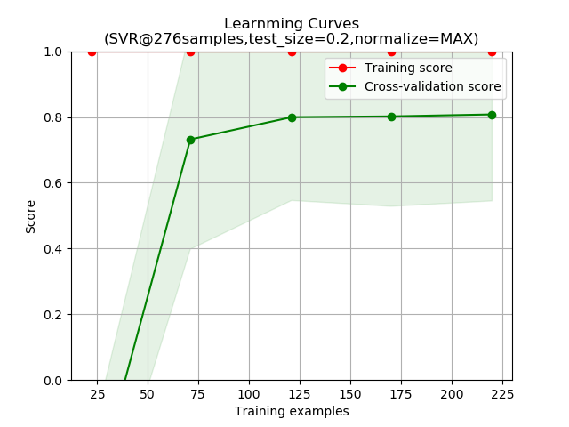
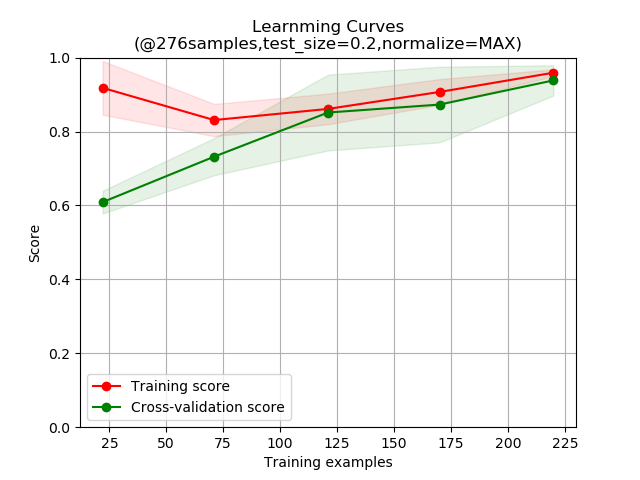

# COVID-19_practice
基于COVID-19新冠肺炎开源数据集[covid-chestxray-dataset](https://github.com/ieee8023/covid-chestxray-dataset)使用三种机器学习算法训练分类模型。

## 模型说明
> 原始数据集中包含了MERS、SARS、ARDS等具有相似症状患者的X光或CT胸透图片，其中CT图片相对较少（147例中有24例），故以X光图片为主要训练样本。    
> 
> 为了简化模型，初步将COVID-19患者样本标记为正类，其他疾病患者样本标记为负类，即将其视为简单二分类模型进行训练。    
> 
> 以Python下sklearn框架为基础，分别采用线性回归（LR）、支持向量回归机（SVR）、K最邻近（kNN）等算法对其进行尝试，分别获得了三种算法下模型的学习曲线，仅供性能参考，如需实际应用还有待更多实际样本的检验以及进一步优化模型。

## 线性回归模型学习曲线
> 

## 支持向量（回归）机学习曲线
> .png)

## K最邻近算法学习曲线
> 
